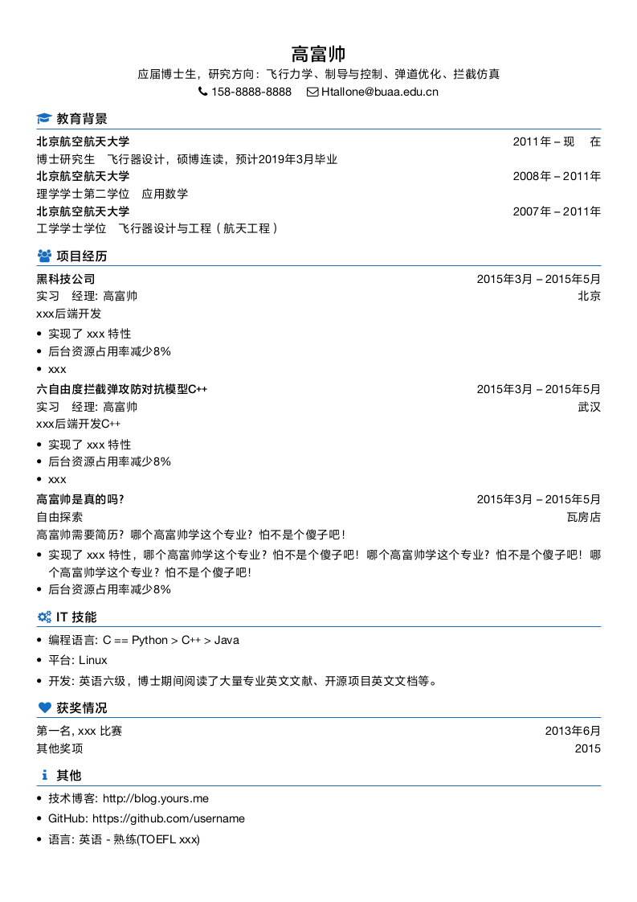

# myCV 中文简历 LaTeX模板

主要参考：

- [billryan/resume](https://github.com/billryan/resume)
- [WonderCV 学生求职模板](https://www.wondercv.com/zh-CN/resume_templates)

在[billryan的 一个简洁优雅的XeLaTeX简历模板](https://github.com/billryan/resume)基础上修改而来，删掉了大部分宏，只保留section定义，从而去掉cls文件，整合到一个tex文件内，严格来讲并不能算是一个模板，但是简历通常只有一两页，反而有时候在一个tex文件修改起来更方便。


简历外观主要参考[WonderCV 学生求职模板](https://www.wondercv.com/zh-CN/resume_templates)，结合[billryan模板](https://github.com/billryan/resume)使用了主题颜色的[Font Awesome Icons](http://fortawesome.github.io/Font-Awesome/icons/)。按照[知乎上关于简历字体的问答](https://www.zhihu.com/question/21451635)，字体和颜色都不超过两种，中文字体使用方正兰亭黑，数字和西文字体使用Helvetica，字体版权原因，这里文件夹Font下是空的，需要自己下载或安装字体，建议使用正版授权的字体；也可以尝试其它字体效果。


## 无照片 myCV.tex

源文件 myCV.tex

使用xelatex编译

```
xelatex myCV.tex
```

或者利用makefile

```
make myCV
```

截图如下




## 有照片 myCV-Photo.tex

源文件 myCV-Photo.tex，利用tikz来插入照片，同时也加入了学校Logo和脚注信息栏，简历正文文字内容与无照片一模一样，只是额外增加三个tikz node，如果想去掉可以屏蔽掉相应语句。由于使用tikz来放置图片，需要多次运行xelatex编译

```
xelatex myCV-Photo.tex
xelatex myCV-Photo.tex
xelatex myCV-Photo.tex
```

或者利用makefile

```
make myCV-Photo
```

截图如下：


# License
与[billryan/resume](https://github.com/billryan/resume)一样吧，

[The MIT License (MIT)](http://opensource.org/licenses/MIT)。

